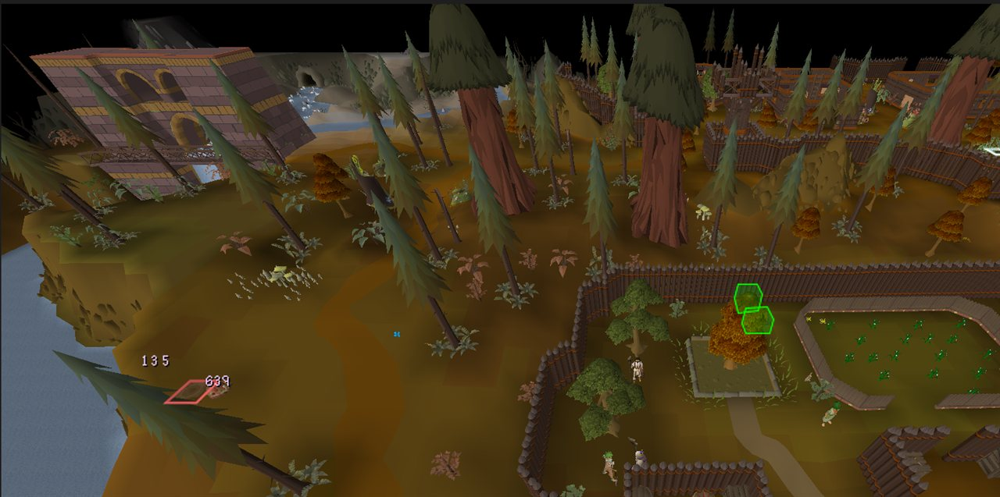
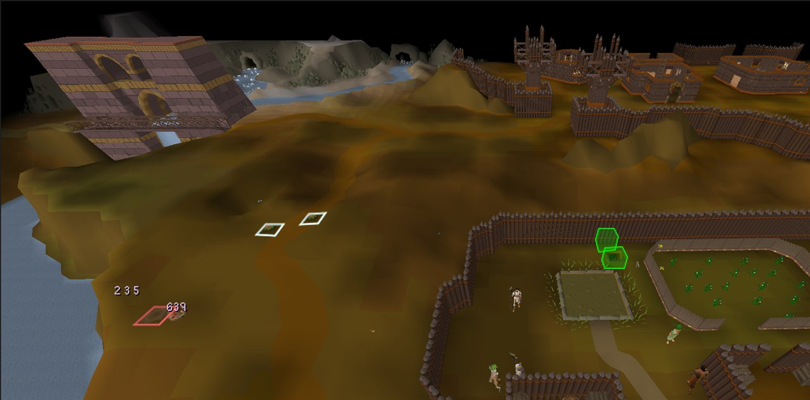
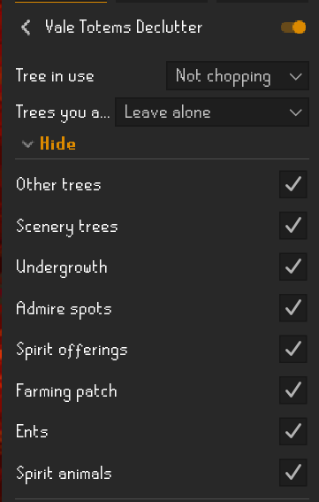

# Vale Totems Declutter

A RuneLite plugin for the Vale Totems activity in Auburnvale (Varlamore).

Pick the tree you are chopping. Every other tree in the vale stops being a left-click target, so
running a totem route no longer means chopping a maple you did not want because it happened to be
in front of the willow you did.

## Screenshots

Before — the vale as the game draws it, every tree and scenery pile a click target:



After — hide toggles on, with only the tree you are using left standing:



The Hide options in the plugin panel, each toggle independent:



## What it does

Pick the tree you are chopping. Then two independent things happen to everything else.

**Menus** — trees you are not using get their chop option pushed below "Walk here", removed from the
menu entirely, or left alone.

**Hiding** — separate toggles take things out of view altogether: other trees, scenery trees you
cannot chop, undergrowth, admire spots, spirit offerings, the farming patch, ents, and spirit
animals. Each has its own name list under Name lists, so anything the defaults miss can be added
without a code change.

Trees outside the vale are left alone. The vale is identified by a hardcoded list of map region
IDs, not a global woodcutting override. Debug mode logs the regions you have loaded if you want to
confirm the coverage.

A few trees right on the edge of Auburnvale can still be affected. With the GPU plugin's expanded
map loading the client draws well past the normal view, and whether something counts as being in
the vale is decided by its map region — so a tree sitting in a border region of the vale may be
hidden or deprioritised even though it looks like it is just outside.

## Using it

1. Install **Vale Totems Declutter** from the Plugin Hub and open its settings.
2. Set **Tree in use** to the tree you are chopping (or **Not chopping** if you brought your own
   logs, which makes every tree clutter).
3. Choose what happens to the other trees under **Trees you are not using** — "Walk here first"
   deprioritises their chop option, "Remove chop option" strips it, "Leave alone" does nothing.
4. Flip on any of the **Hide** toggles for the things you want gone entirely.

Everything is scoped to Auburnvale by default; turn off **Auburnvale only** if you want it to apply
everywhere.

## Building

```
./gradlew build
```

## Running a dev client

```
./gradlew run
```

That launches RuneLite with the plugin side-loaded, in developer mode. Dev Tools is the quickest way
to confirm object names and world coordinates if something in the vale is not being matched.

## Notes

Tree matching is done on object name, not object ID. The vale has a lot of maples and the trees are
multilocs that swap IDs as they deplete, so an ID list would rot. Names are matched against a small
alias list per type — see `TreeType`.

Hide mode sweeps `Scene#getExtendedTiles` on every plane, removing game objects with
`Scene#removeGameObject` and clearing ground decals with `Tile#setGroundObject`. It runs on scene
load and is topped up from `GameObjectSpawned` once the scene is up - never during a load, which
races the map loader and tears the geometry. Objects pulled out only come back with a reload, so any
config change forces one via `GameState.LOADING`, and that means a short black screen.

NPCs are not in the scene graph and cannot be removed. Ents and spirits are hidden by declining to
draw them through a `Hooks.RenderableDrawListener`, the same mechanism core Entity Hider uses. A
renderable that is never drawn has no click box, so hidden creatures cannot be clicked either.

Every name list is matched on object or NPC name only, case-insensitively. Debug mode logs the name
of everything the plugin sees, so anything the defaults miss can be found and added to a list.

Forestry event trees are spared. The Rising Roots event sprouts `Tree roots` and `Anima-infused
Tree roots` in the woodcutting area, and they are choppable like any other tree, so without an
exception they would be hidden or deprioritised along with the species you are not using. Anything
with "root" in its name is always left clickable, whatever tree is selected.

`Spirit offerings` has no actions but is the object you use logs on. It is not scenery, and nothing
should be added to a list that would hide it.
